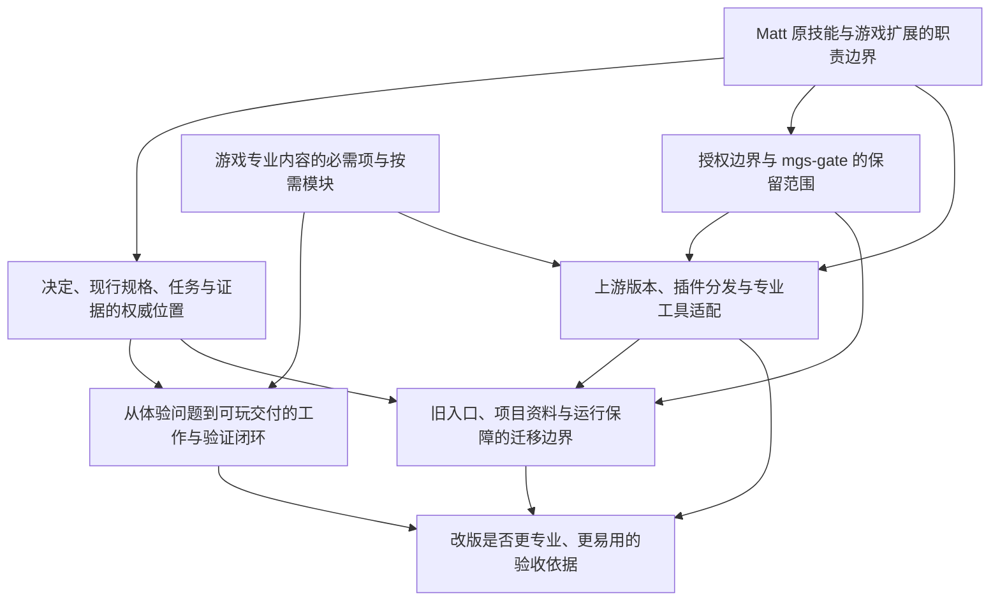

# MyGameStudio 改版：两套技能的对照、方向与决策入口

日期：2026-09-15。状态：分析与建议，尚非实施规格。

## 结论与已确定边界

建议将新版组织为 **Matt 原技能负责通用工程流程，游戏专业扩展负责设计内容和专业验收，项目适配负责具体工具与执行证据**。用户已经选择保留 Matt 原技能，并继续面向个人独立开发者、保持引擎与平台中立。哪些入口退役、运行保障如何调整、怎么分发与迁移，仍需地图里的决策。

MyGameStudio 已经有值得保留的游戏领域成果。此次重点应是解除这些成果与自有流程、角色写入协议、记录后端的强耦合，使专业要求可以进入原生 `wayfinder → to-spec → to-tickets → implement → code-review` 及其短路径；具体触发与资料加载方式必须明确设计，不能假设放进一个 references 目录就会被原技能使用。

## 分析基线与边界

| 对象 | 本轮核实的基线 | 计数口径与限制 |
| --- | --- | --- |
| Matt | `3cca18b368ae95cdbdebbff572ccafa662551015`，插件清单 1.2.3 | 全仓 37 个 SKILL.md；正式插件包含 25 个：engineering 18、productivity 7；misc 4 与 in-progress 8 不等于正式依赖集合 |
| MyGameStudio | `268e2fa6fd535482c3567c8b58f124aa09d93f94`，源码 1.0.0 | 14 个公共入口、6 个内置 Matt 方法；game-design 29 个 Python 文件、records 11 个、runtime 6 个，按受 Git 管理的 plugin 文件统计 |
| 本次分支 | `codex/mygamestudio-mattpocock-redesign` | 已创建本地和 origin 同名分支并核对 SHA 与 upstream；分析文件尚未提交、未推送 |

上游资料实际拉取并固定到提交。MyGameStudio 以本地已与 origin/main 对齐的源码为依据；公开网页本轮未取得正文，不据网页推断发布状态。研究是源码、文档与包内容核对，未运行完整回归、实际客户端或游戏验收。

完整证据分别在[Matt 流程分析](research/matt-workflow.md)、[现有能力分析](research/mygamestudio-current.md)、[专业证据研究](research/game-professional-evidence.md)。README 明确真实宿主交互与效率配对仍未验证，不能用历史审查或版本号填补这项证据。[当前 README](../../README.md)

## 两套系统的实质区别

**Matt 是可组合的工程方法。** `ask-matt` 提供主流程、入口和例外：小而明确的工作可以直接实现，大而模糊的工作先用 wayfinder，地图清楚后再汇成规格；不需要每次顺次运行全部技能。`grilling` 把事实调查交给 Agent、决定留给人；`domain-modeling` 维护领域词汇；`to-spec` 汇总已有讨论；`to-tickets` 产出可独立验证的窄切片并表达真正依赖；`implement` 使用约定接缝做 TDD 和评审。主路径有约定，但没有要求 MGS 那样的自有服务成为所有写入的前置条件。[上游路由](https://github.com/mattpocock/skills/blob/3cca18b368ae95cdbdebbff572ccafa662551015/skills/engineering/ask-matt/SKILL.md)

**MyGameStudio 是专业入口加记录和运行系统。** 当前包内只带六个 Matt 方法，主要服务讨论；Game-Spec、Game-Plan、Game-Implement 按游戏侧自有合同工作，`to-spec`、`to-tickets`、`implement` 并未随包。这是明确的既有选择，因此本次不是简单补装几个上游文件，而是改变流程权威。[来源与复用边界](../../plugin/provenance/manifest.md)

游戏侧有更细的成果责任：设计、正式制作、构建、独立审查与人工试玩分开；任务分流、执行责任、进度和验收分别记录；实际产物、版本与证据对应。代价是业务步骤需要读取合同、CONFIG、后端、授权与写入协议，设计讨论也依赖 Python 的保存/同步接缝。文件和调用数量能够说明系统规模，**不能单独证明实际使用变慢**；效率结论必须另做配对测量。[现有能力分析](research/mygamestudio-current.md)

值得完整保留的上游制度包括：用问题建立地图、按依赖前沿推进、原型服务具体疑问、当前规格有明确范围、实现票可独立接手、自动化反馈、独立 Standards/Spec、按主来源恢复上下文。保留原技能并不要求整包加载 productivity、misc 或实验技能，也不意味着每个游戏项目都必须跑同一条长流程。

## 当前十四入口的调整方向

以下是候选映射，不是已经批准的删除、改名或目录设计。“扩展”指明确输入、专业内容、结果及证据要求的材料或专业技能，具体形式由职责票决定。

| 当前入口 | 建议方向 | 应保留的游戏价值 |
| --- | --- | --- |
| Game-Status | 项目状态查询/游戏里程碑视图按需保留；复用原 tracker 数据 | 当前可玩目标、待体验判断和真实阻断；不建立第二套任务状态 |
| Game-Producer | 收窄为游戏目标与专业路由，通用流程交给 ask-matt 等原技能 | 项目方向、下一份可玩成果、变更影响及专业协作；不再重写整条工程流程 |
| Game-Init | 原 setup 管 tracker/triage/domain；游戏接入只补专业配置和已有项目分析 | 尊重已有项目资料、引擎/资源/构建能力与缺口 |
| Game-Plan | 通用拆票职责回到 to-tickets；原入口评估迁移/兼容 | 可玩切片、独立资源任务、集成责任与人工验收的补充要求 |
| Game-Design | 保留并提炼为核心游戏设计扩展，使用 grilling/wayfinder | 十二领域查漏、九类规则规格、数值与边界、玩家旅程、变更与删减 |
| Game-Spec | to-spec 负责规格汇总；游戏扩展提供内容标准与当前 GDD/系统规则的引用 | 已采纳规则、数值与配置、内容需求、版本范围和验证方案 |
| Game-Prototype | 与 prototype 共享“回答一个未知问题”的流程；保留游戏原型专业能力 | 手感、核心循环、规则或资源预算验证；明确结论的适用范围 |
| Game-Implement | 实现调度回到 implement；原入口评估兼容 | 游戏资源、代码、构建集成和具体成果责任 |
| Game-Code | 降为实现时按需读取的游戏技术方法或项目适配 | 游戏状态、输入、帧循环、存档等项目实际问题，沿用 tdd/诊断方法 |
| Game-Art | 保留专业能力，是否独立入口待职责矩阵决定 | 视觉目标、格式、来源、预览、导入与游戏内效果 |
| Game-Audio | 保留专业能力 | 声音用途、实际可播放产物、循环/响度等适用规格、听感及集成 |
| Game-Build | 保留构建/运行专业能力，具体命令归项目适配 | 真实构建、目标平台、启动检查、源输入与产物关系 |
| Game-Review | 代码复用原 code-review；专业资料按需补独立审查 | 设计/资源/构建的专业标准、真实待审范围与证据限制 |
| Game-Playtest | 保留游戏专业能力 | 版本绑定、实际步骤与反馈、体验问题、后续决定 |

这一映射来自[十四入口逐项核查](research/mygamestudio-current.md)，其目标是消除管理职责重复，不能按表直接删除现有入口。也不要先定一个“必须只剩几个技能”的数字，再为凑数量合并职责。

## 游戏专业内容怎么加强

**先提炼已有成果。** 十二领域覆盖检查、九类模块规格、规则例外、数值单位/范围/取整、玩家旅程、变更及删减影响、正式构建与真实人工反馈已经有落点。应把专业判断标准与保存/渲染/权限机制拆开评估。尤其 `coverage_map` 依赖调用者提供结构化领域材料，`journey` 只实现有限资源/解锁矛盾检查；这些不是自动经济平衡器，也不能自动证明设计好玩。[源码能力边界](research/mygamestudio-current.md)

**优先补强四类可选合同。**

1. **性能证据**：目标设备、代表性场景、预算、实际构建与测量条件。FPS 数字由项目选择，编辑器数据不自动代表目标设备。[Unity 官方性能方法](https://unity.com/how-to/best-practices-for-profiling-game-performance)
2. **资源完整集成**：素材合格、引擎导入、实际引用、导出后加载及视听表现分别有证据，避免只有资源文件却没有进入游戏。[Godot 官方导入流程](https://docs.godotengine.org/en/stable/tutorials/assets_pipeline/import_process.html)
3. **持久状态与恢复**：有存档时说明保存对象、时机、退出恢复和异常处理；有旧数据且变更影响它时，再确定兼容与迁移要求。适配实现由具体引擎承担。[Godot 存档教程](https://docs.godotengine.org/en/stable/tutorials/io/saving_games.html)
4. **发行准备**：确定发行平台后，核对商店声明、支持平台、功能、当前构建和审核材料；准备完成、审核通过、实际发布分别记录。Steam 只是条件实例，不是所有游戏的统一流程。[Steam 官方审核流程](https://partner.steamgames.com/doc/store/review_process?l=english)

玩法/成长/经济、内容生产、关卡、叙事、引导等仍应进入专业范围讨论；本轮不假装已经对每个专业领域做了完整方法论研究。多人联网、持续运营等是否首批支持，取决于专业范围票，不默认为每个独立游戏必须配置。

**体验反馈接回设计决定。** 行为检查能说明规则是否按预期执行；试玩能提供特定参与者与场景下的体验观察；商业效果需要另外的实际证据。这三者分开记录。每次主观试玩先明确要回答的问题，再把反馈对应到继续、调整或补充验证；不强制统一样本量。[Steam Playtest 反馈说明](https://partner.steamgames.com/doc/features/playtest)

## 必须先解决的整合冲突

**调用制度。** Matt 明确区分用户调用与模型可调用技能；按其维护规则，路由器提示人选择，不能自动串起用户调用技能。MGS 当前则允许制作统筹明确委派全部业务入口。因此新 Game-Producer 如果仍自动运行整条原技能链，就改变了用户希望保留的上游制度。建议保持原入口的调用语义，把可共享的游戏专业要求作为明确可达的资料/模型可调用能力；具体接入方法及宿主实际表现需验证。[上游调用规则](https://github.com/mattpocock/skills/blob/3cca18b368ae95cdbdebbff572ccafa662551015/.agents/invocation.md)

**提交与评审。** `implement` 要求完成后提交，用户规则却要求明确提交授权；后者优先。另一个静态可见接缝是 implement 先 review 后 commit，而 code-review 正文只检查 `<base>...HEAD`，不包含未提交改动。需明确如何冻结完整待审产物、两轴针对什么对象、何时才提交，不能为了适配评审擅自提前 commit。本轮识别的是源文件组合问题，未运行它们复现失败。[implement](https://github.com/mattpocock/skills/blob/3cca18b368ae95cdbdebbff572ccafa662551015/skills/engineering/implement/SKILL.md)、[code-review](https://github.com/mattpocock/skills/blob/3cca18b368ae95cdbdebbff572ccafa662551015/skills/engineering/code-review/SKILL.md)

**记录权威。** 建议保留一套 tracker：map 索引决策票，票保留答案；当前 GDD/模块规则维护设计，实施票引用相关规格；构建/试玩报告记录实际证据。triage 是分流，closed 是票的生命周期，人工验收是另一项事实，三者不能互相替代。MGS GitHub 当前依赖主要写进正文、父子才尝试原生关系；若选择原生 Matt tracker，应明确依赖表现和迁移，不继续维护两套“可开工”权威。[后端核查](research/mygamestudio-current.md)

**运行保障。** 建议将 mgs-gate 作为独立取舍评估：保留强制能力、按项目启用，或收窄至有真实需要的范围。它现有的角色/任务/用途/授权交集、并发与失败处理有实际价值；不能直接以“Matt 没有”推导为应删除，也不能把提示词约定声称成等效技术强制。默认形态尚未决定，所承诺的安全边界与实际宿主条件需要配套验证。[当前协议](../../plugin/internal/protocols/gate-protocol.md)

**上游分发与升级。** 保留原技能不等于必须把全部源文件再次内置。独立安装便于跟随上游；固定快照组合便于锁定兼容性，代价是维护升级与适配清单。建议固定采用 SHA、明确共享依赖、保留许可与本地差异、禁止重复安装同名技能，把实验技能单独评估。最终分发方式留给相应决策票；不直接使用上游作者的本地开发链接脚本作为用户安装器。[分发研究](research/matt-workflow.md)

## 推荐的后续推进次序

先确定职责矩阵与专业合同，再确定记录权威、调用方式和运行保障，然后才定包结构、兼容和迁移。最后将决定汇总为规格、确认测试接缝、按可验证成果拆实施票。不要先翻写十四个 SKILL.md，再用新名字解释旧架构。

验证时选小而完整的两条路径：一条从模糊玩法到可试玩切片，一条从已有设计变更到资源/代码集成和实际试玩。再补短任务、单独资源、中断恢复、未提交审查和迁移场景。这是候选验证策略，具体样本、阈值和阻断条件尚未采纳。

验收同时看专业内容与流程成本：规则/边界是否足以执行，产物是否真实接入，评审与试玩是否对应当前版本；还要测用户问答、维护位置、工具操作和经过时间。不能用文件少、技能少或测试数量大作为单独成功标准。

## 决策地图快照

权威是[改版地图](map.md)及它的子票；下图仅为本次建图后依赖关系的展示。全部八张票仍开放、未认领，没有将建议代填为答案。地图清楚后才进入正式规格与实施拆票。

当前可讨论的前沿为[Matt 原技能与游戏扩展的职责边界](issues/01-native-workflow-boundary.md)和[游戏专业内容的必需项与按需模块](issues/02-game-professional-contracts.md)。按编号顺序，下一会话先处理职责边界，产出具体复用矩阵、调用示例与需要显式适配的最小差异集。

本轮只新增本目录的分析、研究和决策地图；未修改插件实现、既有合同、治理文件或原项目地图，未提交分析文件，未创建远端工单。本次文档核验不代表插件或真实游戏验收通过。

## 本轮核验结果

- 13 份 Markdown 产物齐全：本分析、地图、3 份研究、8 张决策票；本地引用目标均存在。
- 8 张票均开放、未认领、无答案；父图、类型、依赖存在且依赖图无环。当前前沿与上图一致。
- 上游研究覆盖 37 份 SKILL.md，正式清单核对为 25 项；指定 Wayfinder 与固定上游正文一致。汇总时再次对照当前源文件核实调用、提交、评审范围和测试纪律。
- 本地 HEAD、upstream、远端分支均仍为 `268e2fa6fd535482c3567c8b58f124aa09d93f94`；工作区新增仅本次分析目录，已有受 Git 管理文件未修改。
- 未运行插件行为回归、重新打包、客户端交互或真实游戏测试；它们属于后续实施与验收，不是本次文档检查的通过项。
