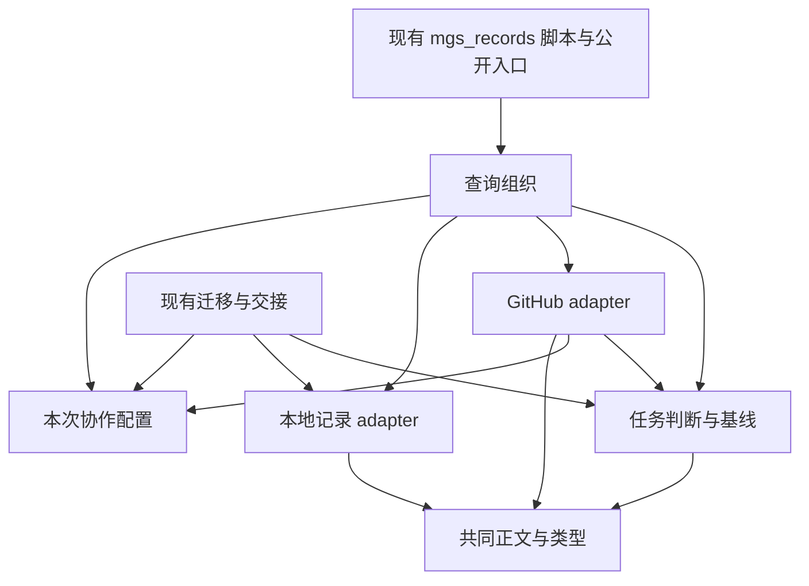

# 第一阶段：原子任务读取统一

状态：已确认，确认记录见[总方案](design.md#方案确认记录)。使用兼容采用用户已确认的 [D1](design.md#d1-使用兼容)。本文件定义职责与验收，不包含产品实现。

## 需要解决的行为

`startable_tasks` 在 [mgs_records.py:524](../../plugin/records/mgs_records.py) 先取任务，再由 `task_dependencies` 再取一次。合成项目中，一次 ready 读取 CONFIG 六次、本地每份 task.md 两次；GitHub 分支拉取全量任务两次。第二次响应改变依赖时，结果混用了第一次任务内容与第二次依赖。

第一阶段使一次可开工查询的任务信息、依赖和来源事实来自同一份读取结果。下一次查询重新读取，能够看到用户后来修改的任务或配置。

共同的任务正文解析同时存在于本地 `_parse_task_file` 与 GitHub `parse_issue_body`。GitHub 反向引用 records 的解析、校验、配置和任务列举，records 又分发到 GitHub；只迁移 Markdown 助手不足以消除循环。

## 范围

- 统一 `config/list/show/deps/ready/baseline/verify` 的内部配置读取与相关任务读取职责，保留外部用法。
- 共享原子任务正文、错误类型和已存在的核心核验规则；文件结果与评论结果仍由对应 adapter 处理。
- 整理 `mgs_records` 与 `mgs_github` 的反向依赖；迁移和交接中对配置、本地任务及核心文档分类的引用随归属调整。
- 行为修正仅包含下方登记的 R1；其余输入下保持现有输出含义、顺序、错误与失败表达。
- 远端写入、授权撤销、恢复登记、迁移操作顺序和缓存格式保持原样；涉及这些调用的依赖调整须有对应回归结果。

## 对外 interface 的兼容表面

| 入口 | 保留的结果与定位方式 | 不能顺手改变的细节 |
| --- | --- | --- |
| `config` / `load_config` | 原有配置字典与默认路径 | 不把原始 CONFIG 文本、内部读取对象或新增授权凭据加入公开返回 |
| `list` / `list_tasks` | CLI 继续返回 JSON 数组；Python 继续返回任务列表 | 本地按目录排序；GitHub 的 list 按 identity 排序；CLI 保留当前字段投影与离线 `cached_read` |
| `show` / `read_task` | 本地按任务目录定位；GitHub 按正文 identity 寻找 Issue | 本地不能改成按正文 identity 全量搜索；远端详情和评论的读取保留 |
| `deps` / `task_dependencies` | 保留 `edges/unresolved/cycles/ok` | 本地沿目录顺序；GitHub 沿当前 `_tasks_for` 的远端任务顺序；不统一改为 list 的排序 |
| `ready` / `startable_tasks` | 保留 `startable/blocked/note` 与 `cached/fetched_at/source`，离线时保留 `cache_note` | 不改分流和完整字段规则；任务与来源同一次获取；输出不变成新 envelope |
| `baseline` / `baseline_report` | 保留 `ok/docs/affected_tasks/note` | 指纹归一规则、格式修正和实质变化含义保持；完成事实不因旧引用自动作废 |
| `verify` / `verify_project` | 保留检查名称、顺序和结果；远端保留 `offline/skipped` | 配置缺失仍转为检查结果；离线“未核对”不能变成确认通过；评论与标签核验保留 |
| `github_backend` | 保留现有工厂调用与 transport/端点/缓存选项 | 内部调用可使用已加载配置构造后端；不要求外部调用方改传内部数据对象 |
| 脚本和 Python 导入 | 继续能运行 `records/mgs_records.py`，现有公开函数和错误类型可用 | 一份 `RecordsError` 类型；GitHub 异常仍可被其捕获；只调整仓库自身对私有实现的依赖 |

CLI 正常结果仍输出 JSON；捕获的 `RecordsError` 或 `OSError` 保留错误对象与退出码 2；`deps/verify/baseline/handover` 的判定失败保留退出码 1；成功保留 0。`ready` 的阻塞任务不会因结构整理改成命令失败。没有 `current` 子命令，不新增该命令。

Python 调用的 `project_root/config_rel/transport/api_base/cache_dir` 等既有参数保持。原本由模块调用抛出的错误不统一吞掉或改成“空集合”。GitHub show 离线时的 `cached_read/cached_note/body_sha256` 继续保留；只排除现有规则排除的 PR，不提前过滤缺身份或畸形任务，以便 verify 仍能报告它们。

## 建议的 module 与依赖方向

名称是实施建议，职责和依赖方向是约束；不把一个小函数机械拆成一个文件。

| module 职责 | 吸收的内容 | 依赖纪律 |
| --- | --- | --- |
| 任务正文与共同类型 | Markdown 头部/小节/工作请求、任务字段与错误类型 | 接受文本；不创建网络或读取会话；不依赖后端分发 |
| 协作配置 | CONFIG 解析、仓库坐标与授权声明的文本解析 | 保留输入原文供本次判断；解析声明不等于允许写入；不依赖 GitHub 执行实现 |
| 任务判断与基线 | 依赖图、任务核心核验、开工判断、基线规则 | 使用已取得的任务和本次文档内容；不能自行再次获取全量任务 |
| 本地记录 adapter | 目录列举、按目录读取、结果文件与索引核验 | 接收本次已解析配置，使用共同正文规则；迁移读取可直接复用它 |
| 查询组织 | 选择实际 adapter，控制本次读取生命周期，组装现有结果 | 可依赖本地和 GitHub adapter；它们不反向导入查询组织 |
| 命令行与兼容入口 | 参数解析、现有输出投影、退出码及公开导入定位 | 将业务行为交给现有 interface；不再包含正文解析、依赖计算或恢复规则 |

首轮建议只新增两个有实质内容的中性文件：`mgs_record_model.py` 承担共同类型、正文和纯记录核验；`mgs_record_source.py` 承担协作配置、本地 adapter 和文档位置检查。查询组织及既有 CLI 暂留 `mgs_records.py`，GitHub 存储职责留 `mgs_github.py`。上表是逻辑 module 的划分，不要求六种职责立即变成六个文件。

搬移后实际计行；若兼容入口文件仍超出约定长度且混合 CLI 与查询职责，再把 CLI 移入单独文件，旧脚本保持原调用入口。不要为满足源码文本检查而写空转发函数。`test_plugin_package.py` 当前检查源码包含 `def` 的部分应改为导入与调用验证，保持其真实兼容目的。

GitHub 中的迁移/交接代码可以暂留原文件，但对本地任务读取改为直接依赖本地 adapter，对配置和共同规则依赖其实际归属。不要用新的延迟导入掩盖反向调用；保留原函数入口，保持迁移语义。必要的兼容导出使用直接导出，避免把所有内部函数永久暴露。

已有两个 adapter 足以支持真实 seam，不引入通用后端注册框架。查询 module 的 depth 来自完整处理读取和来源纪律；locality 是任务与依赖在一起判断；leverage 是 ready、deps、核验共享规则。

## 单次读取的生命周期

1. 在顶层调用开始后读取 CONFIG 内容一次，并由同一原文解析配置与执行条件。
2. 由本次配置确定任务 adapter；如果需要任务集合，获取一次并保留其原始顺序和来源事实。
3. 本次判断使用的任务列表、依赖关系和缓存标识都从该结果推导。用于 list 的排序副本不改动其他判断使用的序列。
4. 需要核心文档时，在本次调用内按实际路径复用已读取文本；同一文本生成逻辑版本与指纹判断。下一次调用不复用前次文档内容。
5. 按现有公开返回格式输出，调用结束后释放本次内部读取状态。

内部读取结果携带配置、必要原文、任务和读取元信息；该容器不成为新增公共参数或返回字段。具体用字典、数据类还是内部对象由实现时的最小方案决定。

“一次获取任务集合”不是“所有命令最多一个 HTTP 请求”：GitHub show 仍可获取全量列表以定位，再读具体 Issue 和评论；verify 仍需标签与评论核验。这里只删除同一查询内无必要的重复列表获取，不删除满足既有 interface 所需的读取。

这也不是事务快照。多个本地文件和远端响应可能在读取期间变化；方案仅保证取得的数据不被隐式重取后混合使用。需要强一致事务或显式刷新时另行设计，不在本轮暗中增加锁、后台缓存或版本协议。

## 共享正文的保留规则

- 头部只读取首个二级标题之前的文本；同一小节的合并、字段分隔与空值按现状处理。
- 本地结果文件列表、目录名和相对路径由本地 adapter 补齐。
- GitHub 的正文、Issue 号、labels 优先级、分流冲突、关闭原因与评论字段由 GitHub adapter 补齐。
- 未知小节与原始正文的保留按现有返回与写回路径执行；只抽取读取规则，不重写任务文本。
- 本地与 GitHub 对同一畸形任务的核心核验继续一致；后端专有错误继续能定位到目录或 Issue。

## 行为修正登记

### R1 一次可开工查询混用两个时点

原行为：一次 ready 拉取任务两次；第一个响应中任务无依赖，第二个响应中同任务新增不存在的依赖时，返回把第一次任务信息与第二次依赖拼为 blocked。

预期行为：本次 ready 只使用第一次且唯一一次任务集合；第二个响应不应被本次查询消费。下一次 ready 重新读取，按当时依赖产生新的结果。

验收必须同时证明本次只获取一次、没有跨调用缓存，以及第二次顶层调用确实看见修改。不能仅检查内部助手被调用次数而跳过最终 `startable/blocked`。

## 实施切片（尚未创建工单）

1. **行为基线与反例**：固定公开入口输出、排序、错误及来源语义；加入 R1 与读取计数的合成正反对照。
2. **ready 单次读取闭环**：将依赖计算从重新读取任务改为使用已取集合；复用 CONFIG 原文，保持外部返回和真实调用路径。
3. **共同正文与配置归属**：迁移共同语义，改动后端、迁移/交接的依赖方向；保留公开入口和单一错误类型。
4. **其他读取入口接入与收口**：list/show/deps/baseline/verify 按其现有语义使用同调用配置与必要数据；核对调用图、CLI 和交付包依赖闭包。

每个切片都有可观察结果，先完成上一切片的检查再进入相关下一片。准备工单时按代码实际耦合确定是否需要继续拆分，不能只把“移动若干文件”作为一项可验收成果。

## 验收矩阵

| ID | 场景 | 必须观察到 |
| --- | --- | --- |
| READ-01 | 本地正常 ready，多份任务与依赖 | CONFIG 原文读一次，每份 task.md 读一次；最终分类与原静态输入结果一致 |
| READ-02 | GitHub 正常 ready | 全量任务集合获取一次；同一份返回支持依赖和任务判断 |
| READ-03 | 第二次预备响应改变依赖 | 本次查询不消费第二响应；不产生两个时点混合结果 |
| READ-04 | 两次顶层调用之间修改 CONFIG、任务或基线 | 第二次调用读取新内容；不保留跨调用状态 |
| READ-05 | 远端不可用，有/无缓存 | 有缓存保留来源、时间与标识；无缓存维持失败；不静默回退本地 |
| READ-06 | 同一任务身份与目录排序相反；远端顺序非 identity 顺序 | 本地目录顺序、GitHub list 排序、ready/deps 原顺序分别兼容 |
| READ-07 | 本地目录名与正文身份不同，及任务不存在 | show 仍按目录定位；错误格式和退出码保持 |
| READ-08 | 同正文由本地/GitHub 读取，含空字段、未知小节和畸形任务 | 共通字段与核心核验一致；后端专有字段与分流覆盖规则保留 |
| READ-09 | CLI list、show、deps、ready、baseline、verify 的成功和失败 | 返回类型、字段、原因与退出码兼容；真实脚本入口有效；无新增 envelope |
| READ-10 | 直接导入与脚本方式触发 GitHub 记录错误 | 同一错误继承关系；异常被现有捕获分支处理，不泄露未捕获 traceback |
| READ-11 | GitHub show/verify 的详情、评论与标签 | 必要读取仍实际发生；评论失败和离线未核对保持原表达 |
| READ-12 | CONFIG 在途撤销、实例撤销、审计故障 | 写入侧锁内重读及拒绝不受读取复用影响；原回归语义保持 |
| READ-13 | 后端迁移计划与交接读取 | 仅依赖归属变化；源任务、映射、引用和权限要求不变；替身验证不产生真实远端写入 |
| READ-14 | 包内模块重组 | 直接运行脚本、MCP 运行时引用、provenance 与交付包检查通过；无开发机路径依赖 |

先复用 `tests/test_records_backend.py`、`tests/test_github_backend.py` 的行为基线；涉及运行时和 CLI 路由再运行对应现有检查。测试应从上述 interface 驱动，少量内部检查只验证真实 seam 或异常类型，不镜像实现逐行断言。

READ-10 分别覆盖 records 先导入、GitHub 先导入和直接运行脚本三种方式；确认完成后才移除现有 `sys.modules` 异常身份补丁。READ-07 还需证明本地 show 不扫描无关任务。READ-06 使用结果副本检查，避免 list 的排序或 `cached_read` 标注原地污染其他查询。

阶段完成时报告新旧行数、CONFIG 与任务读取次数、反例变化和保留行为。暂不规定真实网络耗时改善百分比，也不以这组检查代替完整宿主验收。

## 权限与回退

本地读取 module 继续只读；GitHub 抓取沿既有缓存写入约定，不新增缓存布局。本阶段不修改用户记录、令牌或运行策略格式。读取结果不是权限凭证，远端写入仍按原路径在锁内重新检查 CONFIG 和实例身份。

回退只涉及本阶段代码及匹配的包内容，不需要用户数据迁移。日常客户端安装与发布不属于本轮。
