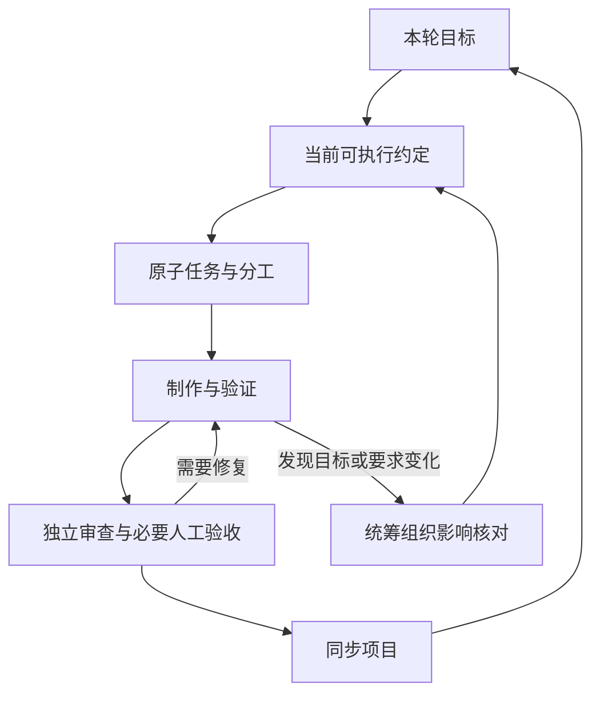

# MyGameStudio：插件工作方式完整设计

设计版本：v1，2026-09-08 汇总完成；决策讨论始于 2026-09-07。状态：工作方式、角色分工及交付合同已形成；这是实现依据，当前尚未编写、安装或发布可执行插件。

## 使用结果

独立开发者可以显式调用 Game-Producer，把想法、当前问题或已批准的制作目标交给制作统筹。统筹读取项目实际状态，组织需要的专业工作，返回成果、证据和仍需人决定的事项。开发者也可以直接调用任何一个业务 Skill。

框架以小步交付可玩的完整体验为主要推进方式，按游戏体量、投入、难度和当前阶段选择必要工作。发布平台、引擎及工具由项目决定，不预设 Web、某个编辑器或商店。

## 三个角色

| 角色 | 承担的工作 | 自身可维护的内容 |
| --- | --- | --- |
| 制作统筹 | 当前目标、范围、计划、进度、依赖、交接、协作配置和专业调度 | 项目管理资料；专业成果由对应角色写入 |
| 方案设计 | 游戏体验、玩法与系统方案、需求规格、设计验证；按需覆盖市场、发行与运营方案 | 产品设计与专业过程记录、隔离验证原型 |
| 制作实现 | 技术设计、代码、视觉音频资源、构建、集成与验证 | 技术文档、正式工程和资源、专业结果与证据 |

角色按可共享的工作上下文划分，不代表三个长期不变的聊天会话。相同专业可以有多个执行实例。审查使用独立的同专业实例，不增设常设评审角色。角色权责细节见[专业角色的职责、产出与决定权](issues/02-role-responsibilities.md)。

## 十四个显式业务入口

| 入口 | 主要用途 | 合同 |
| --- | --- | --- |
| Game-Producer | 接收目标、调度专业工作、同步项目 | [管理](contracts/management.md) |
| Game-Init | 新建接入、接手分析、协作配置与补齐 | [管理](contracts/management.md) |
| Game-Plan | 根据当前规格拆分原子任务，对应 to-tickets | [管理](contracts/management.md) |
| Game-Status | 核对进度、阻塞和恢复位置 | [管理](contracts/management.md) |
| Game-Design | 讨论产品与体验方案、解决设计问题 | [设计](contracts/design.md) |
| Game-Spec | 把已采纳决定形成可执行规格和设计基线 | [设计](contracts/design.md) |
| Game-Prototype | 制作隔离原型回答设计问题 | [设计](contracts/design.md) |
| Game-Implement | 组织本次制作、集成与验证 | [制作](contracts/production.md) |
| Game-Code | 技术方案、代码与代码级验证 | [制作](contracts/production.md) |
| Game-Art | 视觉资源制作、整理与验证 | [制作](contracts/production.md) |
| Game-Audio | 音频资源制作、整理与验证 | [制作](contracts/production.md) |
| Game-Build | 构建、运行与导出 | [制作](contracts/production.md) |
| Game-Review | 独立审查规范和需求符合性 | [审查与试玩](contracts/verification.md) |
| Game-Playtest | 实际试玩、运行观察与人工反馈 | [审查与试玩](contracts/verification.md) |

开始任何业务工作时读取[共同合同](contracts/common.md)，再读取本次专业分支。普通对话不自动触发业务入口。显式调用统筹后，其在授权内选择和委派技能；直接调用专业入口也保留相同的职责边界。

wayfinder、grill-with-docs、writing-for-agents 等作为固定版本的内部方法，由业务步骤明确读取，不额外提供一套同名公共入口。调用安排不是额外授权：讨论功能、制作功能、提交代码和发布成果分别按当前明确请求处理。详见[显式调用与制作统筹的协作边界](issues/01-explicit-invocation.md)。

## 一个游戏开发小闭环

每轮只细化当前需要完成的内容。已有输入充足时可以从中间进入；无需原型的工作跳过原型，无需制作的讨论以决定或待验证问题交付。六个生命周期领域是参照，不是逐项过关的强制流程。详见[游戏开发工作流与阶段通过条件](issues/03-workflow-gates.md)和[小闭环](proposals/game-work-loop.md)。

从方案设计交给制作实现的最少内容是：本轮目标、已采纳的行为规则和边界、相关基线版本、可用素材或原型引用、完成与体验验收标准，以及仍未解决的事项。制作实现据此补充必要技术方案，Game-Plan 组织拆解；不要求先写完整全游戏 GDD 才能开发。逐项记录使用[工作请求与结果](proposals/handoff-templates.md)。

例如给一款已有游戏增加冲刺：先明确冲刺的作用和当前问题；手感不确定时制作隔离原型，并获取必要人工试玩反馈。采纳后更新本轮规则，拆成小任务，制作实现完成正式工程集成和验证，独立审查实际成果，再同步完成与待验收状态。一次小改动可以用很短的规格和单个任务，复杂系统则按依赖拆分。

## 项目控制

统筹维护当前目标与工作安排。目标变化时先组织影响检查，更新相关管理依据，并让专业角色更新设计或技术基线；受影响任务重新分流。已完成成果保留原版本下的事实，不直接算作满足新目标。

直接调用专业 Skill 会留下真实结果，统筹下次显式介入时据此同步普通进度。如果直接调用中发现目标或范围变化，先交回开发者明确调用统筹完成变更同步，再继续受影响工作。

任务分流采用 needs-triage、needs-info、ready-for-agent、ready-for-human、wontfix 五状态；执行责任、验收方式、进度与依赖另行记录。标签不能证明完成。需要人的体验判断时，必须有实际反馈才完成相应验收。规则见[任务分流](proposals/task-triage.md)。

独立成果可并行；同一可写成果同一时间只有一个修改者，并明确集成责任。开始、恢复和交接均核对当前基线与实际成果。具体版本、任务源和结果记录见[工作记录合同](contracts/records.md)。

## 项目文档与初始化

核心基线默认分为项目约定、游戏需求与设计、技术设计三类；每份只保存当前采用的内容。讨论、研究和被替代决定放在过程记录，原子任务引用基线，审查与试玩保存证据。设计已采纳、实际制作完成、验收通过分别表达。详见[文档体系](proposals/document-system.md)。

Game-Init 是统一的项目初始化和接手入口，包含 setup-matt-pocock-skills 对应的协作配置能力。它先读取项目，再确定任务后端、标签映射、核心文档和术语/ADR 位置。首版任务后端为本地 Markdown 与 GitHub Issues；已有有效选择优先沿用，无既定方式的个人项目建议本地 Markdown。任务后端与核心设计文档位置分别配置。

新项目按当前目标按需建文档。已有项目先深度只读分析，优先复用有效资料，再提供具体的复用、新增、修改和冲突处理清单。开发者确认清单后按角色应用并回读；重复运行无缺口则无需改动，中断后核对实际结果和用户后来修改再恢复。切换任务后端也要有明确迁移清单，避免两个当前任务来源。

实际接入时读取[初始化流程](proposals/project-onboarding.md)、[协作配置合同](contracts/project-configuration.md)和[目录布局](proposals/project-layout.md)；创建文档时使用[模板入口](templates/README.md)。当前插件设计仓库仍沿用已有 .scratch 本地任务配置，本设计没有为它迁移后端或改写治理文件。

## 运行保障与包边界

首版要求实际限制越权写入。规则按角色、任务和资源集中定义，通过受控执行环境复用；更换同环境内的工具主要调整用法，新增外部进程或服务时检查其写入边界。统筹委派专业工作，不等于统筹自身获得专业文件写权限。

实现结构及故障要求见[运行保障合同](contracts/runtime.md)；业务入口、内部依赖、任务后端和能力扩展的交付范围见[包与扩展合同](contracts/package.md)。引擎和平台不固定，但每个宣称支持的实际运行组合都要有证据。

现有[本地隔离实验](research/local-execution-boundary-proof.md)支持共享进程写入边界的有限可行性；它未验证完整 Codex 插件、身份绑定、MCP/GUI 或检查器故障处理。因此本轮完成的是设计，完整拦截能力仍是首版实现的验收要求。

## 验收和决策来源

检查设计覆盖和后续实现时使用[验收矩阵](acceptance.md)。追溯开发者决定与来源研究时从[决策地图](map.md)进入；票内 Comments 保留讨论历史，当前约定读取 Answer 及其指向的合同。proposals 目录保留原讨论路径，其中已采纳内容的当前状态以文件说明为准。

本轮交付覆盖工作流、角色、14 个入口的交付合同、文档与目录模板、初始化、任务后端、运行保障及扩展边界。可执行插件、客户端配置、引擎适配和真实游戏制作属于后续实施。
